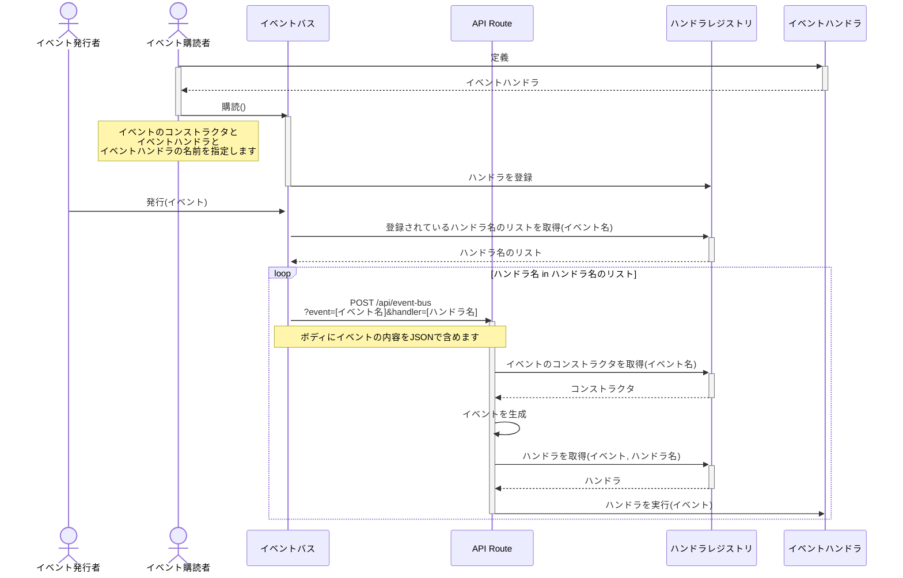

# @ponp/event-bus

@ponp/event-bus は、ドメインイベントを用いてコンテキスト間の連携を行うためのモジュールです。  
ドメインイベントを発行し、リスナーがそれを購読することで非同期な処理を実現します。

## 使い方

### イベントのスキーマ定義

スキーマ定義には Zod を使用します。

```typescript
import { createEventConstructor } from "@ponp/event-bus";
import { z } from "zod";

const sampleEventSchema = z.object({
  text: z.string(),
});

export const SampleEvent = createEventConstructor("SAMPLE_EVENT", sampleEventSchema);

export type SampleEvent = ReturnType<typeof SampleEvent>;

const event = SampleEvent({
  text: "Hello, World!",
});

console.log(SampleEvent.type); // "SAMPLE_EVENT"
console.log(event.type); // "SAMPLE_EVENT"
console.log(event.id); // 自動生成ID
console.log(event.payload); // { text: "Hello, World!" }
```

### イベントバスの初期化

```typescript
import { initEventBus } from "@ponp/event-bus";

const eventBus = initEventBus({ authToken: process.env.EVENT_BUS_AUTH_TOKEN ?? "" });
```

### イベント購読用のエンドポイントを作成

```typescript
// app/api/event-bus/route.ts
import { createHandlerRoute } from "@ponp/event-bus/next";
import { eventBus } from "@/app/bootstrap";

export const POST = createHandlerRoute(eventBus);
```

### イベントの発行

```typescript
import { publish } from "@ponp/event-bus";
import { eventBus } from "@/app/bootstrap";

import { SampleEvent } from "./events";

const event = SampleEvent({ text: "Hello, World!" });

await publish(eventBus, event);
```

### イベントの購読

```typescript
import { subscribe } from "@ponp/event-bus";
import { eventBus } from "@/app/bootstrap";

import { SampleEvent } from "./events";

subscribe(eventBus, SampleEvent, "sampleHandler", (event: SampleEvent) => {
  console.log(event.payload.text); // "Hello, World!"
});
```

## ざっくりとした仕組み

API 呼び出しを行うことで、イベントハンドラが別プロセスとして実行されるようになります。  
これによって Vercel のタイムアウトを回避し、非同期な処理を実現します。


